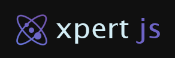

<p align="center">
  
</p>

**xp.js(alpha)** is a framework for Cross Platform React applications.

**xp.js-state** is an single package from that framework.

The goal of this package is to provide a simple declarative API to build complex yet scalable nested states that align with modern challenges, while ensuring a smooth developer experience, as well for your users.

# Key features

- **Optimistic updates**: Encourages developers to write optimistic updates by default.
- **High performance**: Utilizes a signal-based architecture for efficient, fast updates to components.
- **Centralized state**: Provides a predictable global state through mutations.
- **Data synchronization**: With a mutation-change tracking system, you can subscribe to events, to easily synchorize, render optimistic mutations or rollback them.
- **Hook-Ready syntax**: Easily integrates to React components using hooks yntax.
- **Type-Safe documentation**: Offers type autocompletion and comprehensive documentation.

# Quick Start

## Installation

To get ready fast, here you can copy/paste to install from yarn or npm.

```sh
yarn add xp.js-state
```

```sh
npm install xp.js-state
```

## Creating an observable Store

To begin, call the createStoreHook function to generate a new Hook.

Start with an initial state and a group of mutations. The mutations schema will provide a callback with a set of actions that can be performed.

```jsx
type Book = {
  id: string;
  title: string;
  author: string;
  genre: string;
  publicationYear: number;
};

type AddBookParams = Omit<Book, 'id'>;
type RemoveBookParams = Pick<Book, 'id'>;

export const useBooks = createStoreHook({
  initialState: {
    books: [
      {
        id: '1fe8d8aa-ac7d-4bd3-b123-5ca0bea9fac4',
        title: "War and Peace",
        author: "Leo Tolstoy",
        genre: "Historical Fiction",
        publicationYear: 1869
      },
      {
        id: '04b2014f-3d6d-46a9-b5a4-c9345d6e3406',
        title: "Crime and Punishment",
        author: "Fyodor Dostoevsky",
        genre: "Psychological Fiction",
        publicationYear: 1866
      },
      {
        id: '46335384-9fab-41c9-abc0-b1b80e12fab6',
        title: "1984",
        author: "George Orwell",
        genre: "Dystopian Fiction",
        publicationYear: 1949
      },
    ],
  },
  mutations: ({ get, set }) => ({
    addBook: (params: AddBookParams) => {
      set({
        path: "books",
        value: [...get().books, { id: uuid(), ...params }],
      });
    },
    removeBook: (params: RemoveBookParams) => {
      const books = get().books.filter((book) => book.id !== params.id);
      set({ path: "books", value: books });
    },
  }),
});
```

This hook will be accessible globally, containing an array with your store state and an object with mutations.

## Using the Hook in Components

This component demonstrates how to use the useBooks hook to manage a list of books. The addBook and removeBook functions update the global state, and the changes are reflected in the UI.

```jsx
import React from "react";
import { useBooks, AddBookParams, RemoveBookParams } from "./useBooks";

function Component() {
  const [{ books }, { addBook, removeBook }] = useBooks();

  return (
    <div>
      <h2>Books</h2>
      <ul>
        {books.map((book) => (
          <li key={book.id}>
            <strong>{book.title}</strong> by {book.author} ({book.publicationYear})
            <button onClick={() => removeBook({ id: book.id })}>Remove this Book</button>
          </li>
        ))}
      </ul>
      <button
        onClick={() =>
          addBook({
            title: "New Book",
            author: "New Author",
            genre: "New Genre",
            publicationYear: 2024,
          })
        }
      >
        Add Book
      </button>
    </div>
  );
}
```
